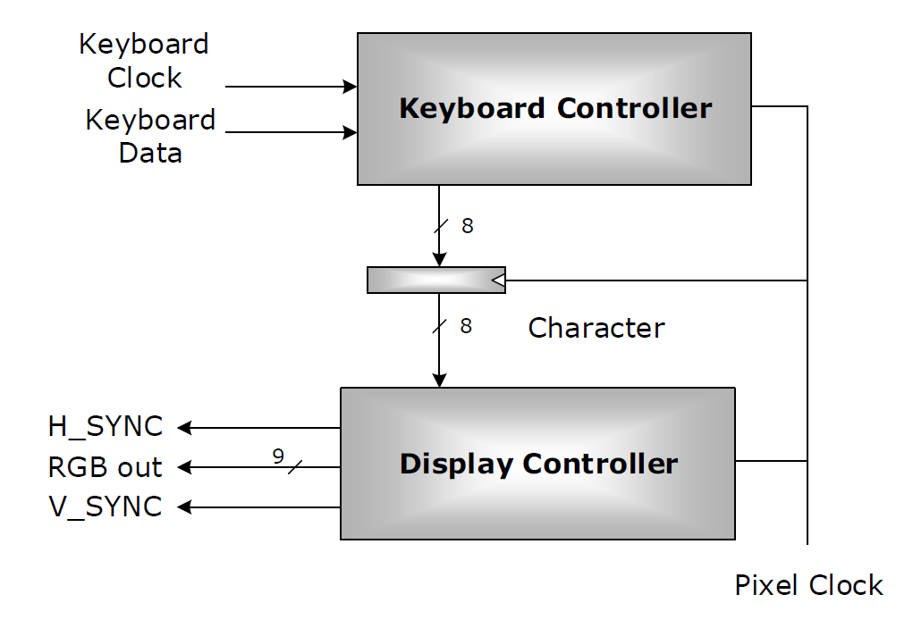

# Graphics driver

The purpose of the project was to build a display system for a VGA screen.

----------
### General System Architecture
----------

The figure below that demonstrates the desired system architecture. The major system components are:
* The Keyboard controller, that reads the instructions from the keyboard
* The Display controller, that controls the display connected to the system

----------
### Instructions
----------
The function of display system is to read commands via keyboard and to set the output on a VGA screen, depending on the command. The keyboard controller accepts &#8592;, &#8593;, &#8594;, &#8595;, _f_ and _r_ keys, and ignores all the other keys. The image displayed on the VGA screen is a rectangle with a fixed line thickness equal to 5 pixels, whose center of gravity is always the center of the screen and whose enclosed area changes according to the commands
entered from the keyboard. The initial dimensions of the rectangle are 20 by 10 pixels. The functionality of the instructions are described below:

| Instruction 	| Scan Code 	|                Description                	|
|:-----------:	|:---------:	|:-----------------------------------------:	|
|      &#8595;	|     75    	| Decrease height of rectangle by 10 pixels 	|
|      &#8593; 	|     72    	| Increase height of rectangle by 10 pixels 	|
|      &#8594;	|     6B    	| Decrease length of rectangle by 10 pixels 	|
|      &#8592;	|     74    	| Increase length of rectangle by 10 pixels 	|
|      _f_    	|     2B    	|             Enters flash mode             	|
|      _r_    	|     2D    	|          Reverses colors of image         	|
